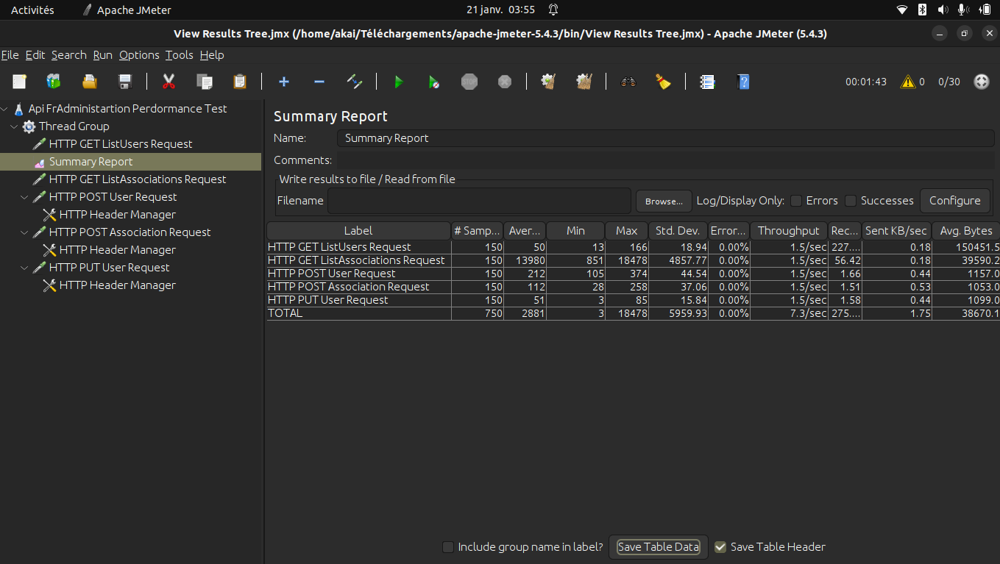
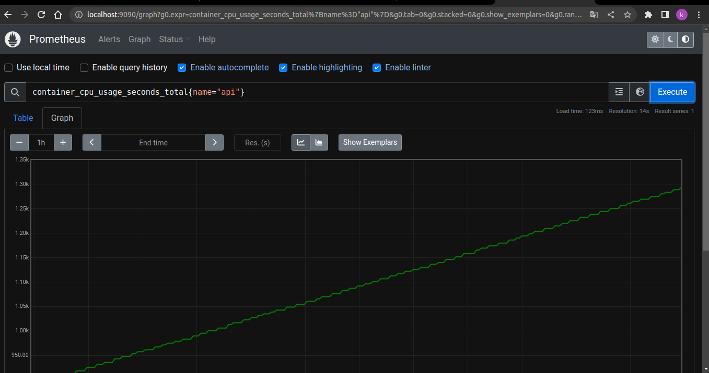
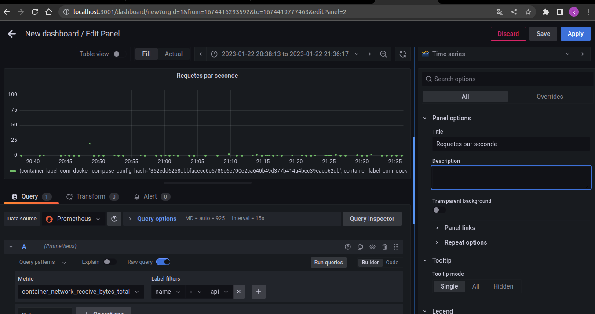

## CHOIX TESTEURS DE PERFORMANCE ET DE CHARGE

***Apache JMeter*** est un outil de test de charge populaire qui permet de simuler des utilisateurs réels en utilisant des scripts de test pour envoyer des requêtes à notre application. Il est particulièrement utile pour les tests de performance en utilisant des scénarios de charge, tels que des tests de charge à haute concurrence, des tests de stress et des tests de récupération après une panne.

Il est également compatible avec une variété de protocoles, notamment HTTP, HTTPS, JDBC, JMS, LDAP, et SOAP, ce qui le rend adapté pour tester de nombreux types d'applications, y compris les applications web, les applications de bases de données et les applications de messagerie.

De plus, Apache JMeter est également capable de générer des rapports détaillés sur les performances de notre application, nous permettant de comprendre les points de blocage et les goulots d'étranglement de notre application. Il peut également être intégré à d'autres outils de surveillance pour fournir une vue complète des performances de notre application.

En résumé, Apache JMeter est un outil fiable et polyvalent pour les tests de charge et de performance qui peut aider à identifier les problèmes de performance de notre application, et fournir des informations détaillées pour les résoudre.

## TESTS DE PERFORMANCE ET DE CHARGE AVEC APACHE JMETER

### Image du test de performance et de charge avec Apache JMeter

### Analyse des résultats du test de performance et de charge avec Apache JMeter

En général, on peut remarquer que les temps de réponse sont assez élevés pour les requêtes GET ListAssociations et GET ListUsers. Il est possible que cela soit dû à une charge importante sur la base de données ou à des problèmes de performance dans l'application. Il serait donc utile de vérifier ces points pour optimiser les performances de notre application.

Les temps de réponse pour les requêtes POST et PUT sont plus bas et dans des valeurs raisonnables.
Il est également remarquable que le débit pour toutes les requêtes est assez similaire et cela peut indiquer que le nombre de requêtes simultanées n'est pas limitant pour le système.

Cela dit, il est important de rappeler que ces résultats ne sont qu'une estimation des performances de votre application car ils ne prennent pas en compte tous les scénarios et tous les points de terminaison de notre API et il peut y avoir des facteurs externes à notre application qui affectent les performances. Il est donc important de continuer à surveiller et à améliorer les performances de notre application en utilisant des outils et des méthodes supplémentaires.

## CHOIX OUTIL DE MONITORING, DE TÉLÉMETRIE OU DE TRACING

***Prometheus*** est un outil de monitoring open source qui permet de collecter et d'analyser des métriques à partir de sources diverses. Il est particulièrement utile pour surveiller les performances de notre application et les ressources système, et pour détecter les problèmes de performance et de disponibilité.

## MONITORING, TÉLÉMETRIE OU TRACING AVEC PROMETHEUS

### Image du monitoring, de la télémétrie ou du tracing avec Prometheus

## CHOIX OUTIL DE SURVEILLANCE DES REQUÊTES/SECONDES ET DUREE DE LA REQUETE

***Grafana*** est un outil de monitoring open source qui permet de collecter et d'analyser des métriques à partir de sources diverses. Il est particulièrement utile pour surveiller les performances de notre application et les ressources système, et pour détecter les problèmes de performance et de disponibilité.

## SURVEILLANCE DES REQUÊTES/SECONDES ET DUREE DE LA REQUETE AVEC GRAFANA

### Image du monitoring, de la télémétrie ou du tracing avec Grafana

